# Nima Mehrani

  <picture>
    <source media="(prefers-color-scheme: dark)" srcset="./profile-3d-contrib/profile-solarized-dark.svg" />
    <source media="(prefers-color-scheme: light)" srcset="./profile-3d-contrib/profile-solarized-light.svg" />
    
  </picture>

  
  
  

  <a href="https://nimamhn.github.io/nimamehrani/">nimamhn.github.io/nimamehrani</a>

## About Me

Website designer with an accounting background. I build clean, modern websites for businesses.

## Tech Stack

  

## GitHub Stats

  
  

  

  

  

  
  

